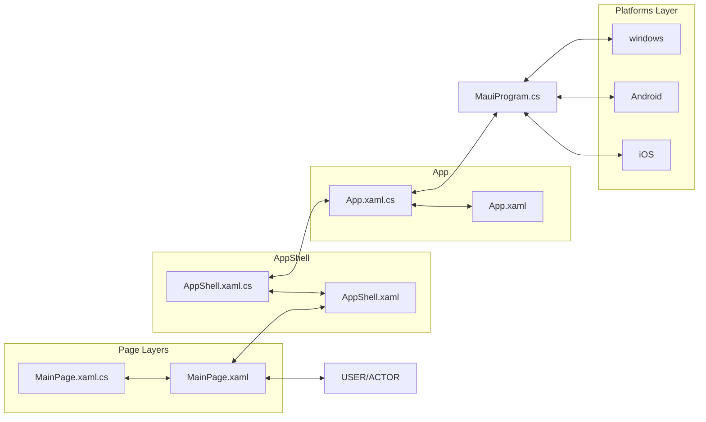
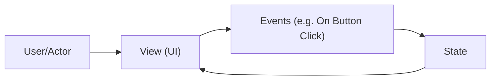

# .NET (MAUI) Basics

## Introduction to Project Files

- `MainPage.xaml` -> contains:

    - `MainPage.xaml.cs` -> defines `MainPage` class and inherits `ContentPage` class:

        - ```csharp
            public partial class MainPage : ContentPage
            {
                int count = 0;

                public MainPage()
                {
                    InitializeComponent();
                }

                // ... event functions in UI
            }
            ```

- `AppShell.xaml` -> contains:

    - ```xml
        <ShellContent
            Title="Home"
            ContentTemplate="{DataTemplate local:MainPage}"
            Route="MainPage>
        ```

        The xaml file renders the `MainPage` as show above.

    - `AppShell.xaml.cs` -> defines `AppShell` class and inherits `Shell` class:

        - ```csharp
            public partial class AppShell : Shell
            {
                public AppShell()
                {
                    InitializeComponent();
                }
            }
            ```

    - Each page should register to `AppShell` no matter what the heirarchy and sequence order because `AppShell` provides url based navigation later on.

- `App.xaml` -> contains:

    - `App.xaml.cs` -> defines `App` class and inherits `Application` class:
        
        - Creates an instance of the `AppShell` registered pages

        - ```csharp
            public partial class App : Application
            {
                public App()
                {
                    InitializeComponent();
                    MainPage = new AppShell();
                }
            }
            ```

- `MauiProgram.cs` - Starting point for cross-platform development, uses the `App` class to build the app.

    - ```csharp
        public static class MauiProgram
        {
            public static MauiApp CreateMauiApp()
            {
                var builder = MauiApp.CreateBuilder();
                builder
                    .UseMauiApp<App>()
                    .ConfigureFonts(fonts => {
                        // ...
                    });

                return builder.Build();
            }
        }
        ```

- **Platforms** - folder containing the starting point of programs for each specific platforms.
    - Each platform runs `MauiProgram.cs`'s `CreateMauiApp()`

        ```csharp
        MauiProgram.CreateMauiApp();
        ```

## Visual Structure



## Architecture - Event Driven Development

.NET (MAUI) is a stateful application



- **State** is the data in a page class
- **View** is an element or layout of a page, or a page itself.
    - `.xaml` files represents the **UI**
    - `.xaml.cs` defined the **UI Logic**
    - There are many types of Views like View UI Elements and View Layouts which can be nested together.
    - In a **Page** (`<ContentPage>`) there should only be one **Parent View Layout**

## Architecture - MVVM Development

N/A

## URL Navigation - Creating New Pages

In Visual Studio you can do the following to create new pages with the right namespaces.

1. _Project\File View Panel_ > _Right Click_ > _Project Name_ > `Add` > `New Folder` > _Input Folder Name_

2. _Right Click New Folder_ > `Add` > `New Item` > `.NET MAUI Content Page (XAML)` > _Input Page Name_

In VS Code in ubuntu development, you might need to fix the namespace of the `.xaml.cs` files of the newly created page inside new folders, because by default it can only create pages in the local namespace.

## URL Navigation - Register New Pages

To start with url based navigation, we first need to register the newly created pages in the `AppShell`.

```csharp
public partial class AppShell : Shell
{
	public AppShell()
	{
		InitializeComponent();
        // ...

        // you might need to include the namespace of the page you want to register.
        Routing.RegisterRoute(
            nameof(PageName), // string: this could be any value but using the page name is cleaner.

            typeof(PageName) // type of the page class
        );
	}
}
```

## URL Navigation - Setting Up New Main Page

In `AppShell.xaml` we can setup and choose a new main page

```xml
<?xml version="1.0" encoding="UTF-8" ?>
<Shell
    ...
    xmlns:local="clr-namespace:ProjectName"
    xmlns:mynamespace="clr-namespace:ProjectName.NewFolder"
    ...
    Title="PageTitle">

    <ShellContent
        ...
        ContentTemplate="{DataTemplate mynamespace:NewMainPage}"
        Route="NewMainPage" />

</Shell>
```

The folder and page `NewFolder/NewMainPage.xaml.cs` should have a namespace of:

```cs
namespace ProjectName.NewFolder;
```

Or you can just create a page anywhere in the project structure that has a namespace in the local scope:

```cs
namespace ProjectName;
```

## URL Navigation - Go To Other Pages

When clicking a button go to another page.

From **NewMainPage.xaml**

```xml
<Button
    Text="btnTxt"
    x:Name="btnName"
    Clicked="btnEHandlerFuncName">
```

From **NewMainPage.xaml.cs**

```cs
private void btnEHandlerFuncName(object sender, EventArgs e)
{
    // in order for this to work the page should be registered in the AppShell
    Shell.Current.GoToAsync(
        nameof(OtherPage),
        typeof(OtherPage)
    );
}
```

## URL Navigation - Go Back To Parent Page

```cs
Shell.Current.GoToAsync("..");

// or

Shell.Current.GoToAsync($"//{nameof(NewMainPage)}");
```
